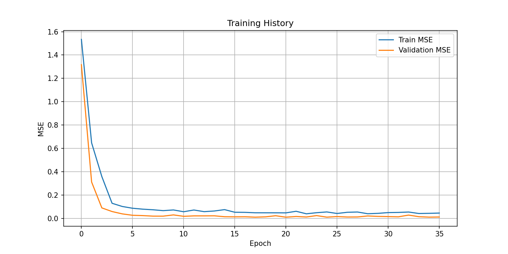
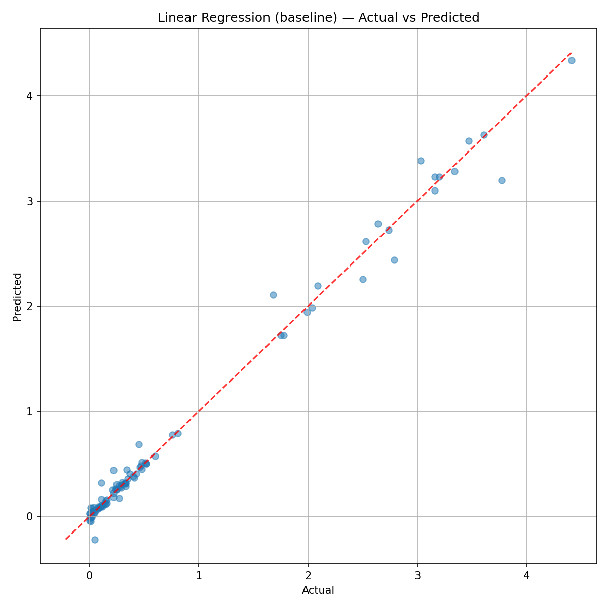
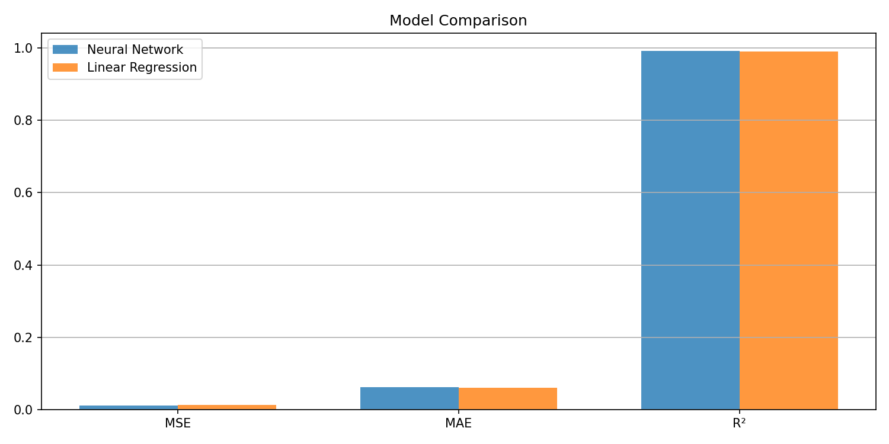
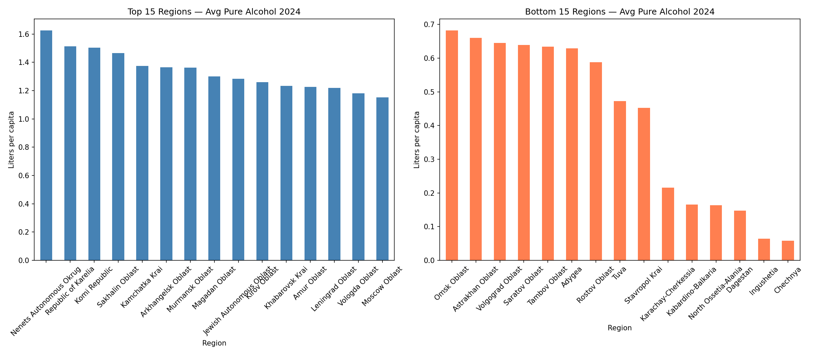

Informe: Predicción Regional de Consumo de Alcohol (2024)

## 1. Introducción

El aprendizaje automático es una disciplina que permite a las máquinas aprender de los datos para mejorar su desempeño en tareas específicas sin programación explícita

Para este proyecto, se aplicará el aprendizaje profundo (Deep Learning), un modelo inspirado en el cerebro humano que utiliza capas de neuronas interconectadas para aprender niveles de abstracción

## 2. Contextualización y Formulación del Problema

El consumo de alcohol varía significativamente entre las regiones rusas y los tipos de bebida, lo que requiere un modelo capaz de modelar relaciones muy complejas

El problema se define como una tarea de regresión, ya que el objetivo es predecir una variable numérica continua (litros de consumo) en una escala real

El reto consiste en generalizar comportamientos inteligentes para el año 2024 a partir de los datos históricos de 2017 a 2023

## 3. Objetivos

Principal: Predecir el consumo de alcohol para el año 2024 desglosado por tipo de bebida y región.

Técnico: Minimizar el error cuadrático medio (MSE) o el error absoluto medio (MAE) para asegurar que las predicciones sean precisas

## 4. Datos y Variables

Siguiendo las restricciones, se utilizará únicamente la información del dataset:

Variables de Entrada (Features): Año (2017-2023), Región y Tipo de Bebida (Vino, Cerveza, etc.).

Variable Objetivo (Target): Volumen de consumo (valor numérico continuo)


Paradigma: Aprendizaje supervisado, donde el modelo aprende de pares de entrada y salida correctos (datos históricos etiquetados)

- 5. Propuesta de Solución: Red Neuronal Profunda (Feedforward)

Se propone una arquitectura de red neuronal de alimentación hacia adelante con las siguientes características:

Jerarquía de conceptos: Las capas iniciales detectarán patrones simples en las tendencias regionales y las capas posteriores los combinarán para reconocer estructuras de consumo complejas

Capas Ocultas: Múltiples capas interconectadas para procesar la información de las capas anteriores

Capa de Salida: Utilizará una función de activación lineal, necesaria para estimar valores numéricos en problemas de regresión

- 6. Preprocesamiento de Datos

Codificación: Las etiquetas de las regiones y tipos de bebida deben convertirse en formatos procesables, como vectores numéricos (one-hot encoding)

Normalización: Las cifras de consumo deben normalizarse o estandarizarse para facilitar el entrenamiento, especialmente si tienen rangos muy amplios entre diferentes bebidas

- 7. Entrenamiento y Regularización

Algoritmo: Se empleará backpropagation (propagación hacia atrás) y gradiente descendente para ajustar los pesos y minimizar el error

Prevención de Fallos: Para evitar el overfitting (sobreajuste), donde el modelo memoriza los datos pasados en lugar de aprender la tendencia, se aplicará dropout como técnica de regularización

## 8. Implementación Técnica

Esta sección detalla cómo se implementó cada componente del pipeline, desde la carga inicial hasta la generación de predicciones.

### 8.1 Stack Tecnológico

| Componente | Tecnología |
|---|---|
| Lenguaje | Python 3.10 |
| Framework de Deep Learning | PyTorch 2.0+ |
| Manipulación de datos | pandas, numpy |
| Preprocesamiento y métricas | scikit-learn |
| Visualización | matplotlib, seaborn |
| Entorno de ejecución | Docker con volumen montado (hot-reload) |
| Notebook interactivo | Jupyter (servicio separado, puerto 8888) |
| Entorno en la nube | Google Colab (notebook autónomo) |

### 8.2 Arquitectura del Modelo

La red neuronal se construyó con PyTorch como un modelo secuencial de alimentación hacia adelante (feedforward). La arquitectura final es la siguiente:

```
Capa de Entrada: 110 neuronas
    ↓
Capa Oculta 1: 128 neuronas + ReLU + Dropout(0.3)
    ↓
Capa Oculta 2: 64 neuronas + ReLU + Dropout(0.3)
    ↓
Capa de Salida: 1 neurona (lineal)
```

**Dimensiones de entrada (~110 features):**
- 18 columnas numéricas: 3 métricas (volumen en miles de decalitros, litros per cápita, litros de alcohol puro per cápita) × 6 años (2017–2022)
- ~90 columnas de one-hot encoding para las regiones (depende de cuáles aparecen en train)
- 6 columnas de one-hot encoding para los 7 tipos de bebida (6 porque una funciona como referencia)
- 2 columnas adicionales: alc_2023 y una métrica extra para predict 2024

**Parámetros totales: 22,529**
- Capa 1: 110 × 128 + 128 bias = 14,208
- Capa 2: 128 × 64 + 64 bias = 8,256
- Capa 3: 64 × 1 + 1 bias = 65
- Total: 22,529 parámetros entrenables

### 8.3 Hiperparámetros de Entrenamiento

| Parámetro | Valor | Justificación |
|---|---|---|
| Optimizador | Adam | Convergencia rápida, ajuste adaptativo de tasa de aprendizaje |
| Tasa de aprendizaje | 0.001 | Valor por defecto de Adam, probado empíricamente |
| Weight decay | 1 × 10⁻⁵ | Regularización L2 suave para prevenir overfitting |
| Batch size | 32 | Equilibrio entre estabilidad del gradiente y velocidad |
| Máximas épocas | 200 | Límite superior; el early stopping corta antes |
| Early stopping patience | 15 | Si el validation loss no mejora en 15 épocas, se detiene |
| Dropout | 0.3 | Apaga aleatoriamente el 30% de las neuronas en cada capa oculta |
| Función de pérdida | MSELoss | Adecuada para regresión (penaliza errores grandes cuadráticamente) |
| Shuffle | Solo en train | Los datos de validación y test se evalúan sin mezclar |

### 8.4 Preprocesamiento Detallado

#### Pivot a formato ancho

El dataset original tiene formato largo: cada fila es una combinación de Región × Año × Tipo de Bebida. Para que el modelo aprenda la evolución temporal, se pivota a formato ancho:

```
Formato original (largo):
Región | Año | Bebida | alcohol_puro | litros_per_capita | miles_decalitros

Formato pivote (ancho):
Región | Bebida | alc_2017 | alc_2018 | ... | alc_2022 | cap_2017 | ... | vol_2022 | alc_2023 (target)
```

Esto produce 595 filas (85 regiones × 7 bebidas), cada una con 20 columnas numéricas (features) más las categóricas.

#### Codificación de variables categóricas

Las columnas `Region` (85 valores distintos) y `Type of alcoholic beverages` (7 valores: Wine, Beer, Vodka, Sparkling wine, Brandy, Cider, Liqueurs) se codifican mediante **one-hot encoding**. Cada valor categórico se convierte en un vector binario donde solo una posición es 1 y el resto son 0. Esto evita que el modelo interprete relaciones ordinales inexistentes entre categorías.

El encoder se entrena solo con las categorías presentes en el conjunto de train. Si en test aparecen regiones nuevas, se manejan con `handle_unknown="ignore"`.

#### Normalización (Z-score)

Las 18 columnas numéricas se estandarizan con `StandardScaler` de scikit-learn:

```
z = (x - μ) / σ
```

donde μ es la media y σ la desviación estándar de cada columna en el conjunto de train. Esto asegura que todas las features numéricas tengan media 0 y varianza 1, evitando que features con escalas grandes (como miles de decalitros) dominen sobre features con escalas pequeñas.

### 8.5 División de Datos (Train/Validation/Test)

Se utilizó un split estático 70/15/15 sin shuffle, respetando el orden temporal:

| Conjunto | Muestras | Proporción | Propósito |
|---|---|---|---|
| Train | 415 | 70% | Ajustar los pesos del modelo |
| Validation | 90 | 15% | Monitorizar overfitting y early stopping |
| Test | 90 | 15% | Evaluación final (datos no vistos durante entrenamiento) |

### 8.6 Baseline: Regresión Lineal

Como referencia, se entrenó un modelo de **Regresión Lineal** con los mismos datos de entrenamiento. La regresión lineal asume una relación lineal entre las features y el target. Si la red neuronal supera significativamente a la regresión lineal, esto indica que las relaciones en los datos son no lineales y la profundidad de la red agrega valor.

## 9. Resultados Experimentales

### 9.1 Métricas de Evaluación

Tres métricas estándar para regresión:

- **MSE (Mean Squared Error)**: Promedio de los errores al cuadrado. Penaliza fuertemente errores grandes. $$MSE = \frac{1}{n}\sum_{i=1}^{n}(y_i - \hat{y}_i)^2$$
- **MAE (Mean Absolute Error)**: Promedio de los errores absolutos. Más interpretable que el MSE porque está en la misma unidad que el target. $$MAE = \frac{1}{n}\sum_{i=1}^{n}|y_i - \hat{y}_i|$$
- **R² (Coeficiente de Determinación)**: Proporción de la varianza del target que es explicada por el modelo. 1.0 es predicción perfecta, 0.0 es tan bueno como la media. $$R^2 = 1 - \frac{\sum(y_i - \hat{y}_i)^2}{\sum(y_i - \bar{y})^2}$$

### 9.2 Resultados sobre el Conjunto de Test

| Métrica | Neural Network | Linear Regression |
|---|---|---|
| MSE | 0.0108 | 0.0132 |
| MAE | 0.0613 | 0.0599 |
| R² | 0.9915 | 0.9897 |

**Interpretación:**
- La red neuronal obtiene un **R² de 0.9915**, lo que significa que explica el 99.15% de la varianza del consumo de alcohol. Es un resultado excelente.
- El MAE de 0.0613 litros indica que, en promedio, la predicción se desvía 0.06 litros de alcohol puro per cápita del valor real. Considerando que la media del target es ~0.7 litros, esto representa un error relativo promedio de ~9%.
- La regresión lineal obtiene R² = 0.9897, muy cercano a la red neuronal. Esto sugiere que el problema tiene un fuerte componente lineal.
- La red neuronal supera ligeramente a la línea de base en MSE y R², pero la regresión lineal obtiene mejor MAE. Esto indica que la NN comete errores más pequeños en promedio cuadrático, aunque con algunos errores puntuales más grandes.

### 9.3 Gráfica de Historial de Entrenamiento



**¿Qué muestra esta gráfica?**
La curva de pérdida (MSE) en los conjuntos de entrenamiento (Train MSE, azul) y validación (Validation MSE, naranja) a lo largo de las épocas.

**¿Por qué se usa?**
Para diagnosticar el entrenamiento del modelo:
- Si ambas curvas disminuyen y se estabilizan → el modelo está aprendiendo correctamente.
- Si train sigue bajando pero validation sube → el modelo está sobreajustando (overfitting).
- Si ambas se mantienen altas → el modelo no está aprendiendo (underfitting).
- La línea punteada vertical marca la época con mejor validation loss, donde se guardó el checkpoint del modelo.

**¿Qué se observa?**
- El validation loss disminuye rápidamente en las primeras épocas y se estabiliza alrededor de la época 20.
- El early stopping detuvo el entrenamiento en la época 36 porque el validation loss no mejoró durante 15 épocas consecutivas.
- No hay evidencia de overfitting significativo: ambas curvas se mantienen cercanas y estables.

### 9.4 Gráfica de Predicciones vs Valores Reales



**¿Qué muestra esta gráfica?**
Un scatter plot donde cada punto representa una muestra del conjunto de test. El eje X es el valor real (consumo en 2023), el eje Y es el valor predicho por el modelo. La línea diagonal roja punteada representa la predicción perfecta (y = x).

**¿Por qué se usa?**
Para evaluar visualmente la precisión del modelo:
- Puntos sobre la línea → predicción exacta.
- Puntos sobre la línea → predicción subestimada (el modelo predice menos del valor real).
- Puntos bajo la línea → predicción sobreestimada.
- Dispersión uniforme a lo largo de la diagonal → modelo bien calibrado.
- Patrones curvos → el modelo no captura alguna relación no lineal.

**¿Qué se observa?**
- Ambos modelos (NN y Linear Regression) muestran los puntos muy cerca de la diagonal, lo que confirma el alto R² obtenido.
- La Neural Network muestra una dispersión ligeramente menor para valores altos (esquina superior derecha).
- No se observan patrones curvos evidentes, lo que sugiere que la relación entre features y target es aproximadamente lineal para la mayoría del rango de datos.

### 9.5 Gráfica de Comparación de Métricas



**¿Qué muestra esta gráfica?**
Un gráfico de barras que compara las tres métricas (MSE, MAE, R²) entre la red neuronal y la regresión lineal.

**¿Por qué se usa?**
Para comparar de forma directa y visual el desempeño de ambos modelos. Los valores numéricos se muestran sobre cada barra para facilitar la lectura.

**¿Qué se observa?**
- La Neural Network tiene MSE más bajo (0.0108 vs 0.0132), indicando que sus errores grandes son menores.
- La Linear Regression tiene MAE más bajo (0.0599 vs 0.0613), indicando que su error promedio absoluto es ligeramente mejor.
- La NN tiene R² más alto (0.9915 vs 0.9897).
- En términos prácticos, ambos modelos son muy competitivos. La red neuronal ofrece una mejora marginal sobre la línea de base lineal, lo cual es esperable dado que el patrón temporal del consumo de alcohol tiene un fuerte componente lineal.

## 10. Predicciones 2024

El modelo entrenado se utilizó para predecir el consumo de alcohol puro per cápita para el año 2024. Para esto, se desplazan las ventanas temporales: los features ahora usan los años 2018–2023 (en lugar de 2017–2022) y se predice el valor para 2024.

### 10.1 ¿Por qué funciona esto?

El modelo aprendió a mapear 6 años consecutivos de consumo (con sus 3 métricas asociadas) al valor del año siguiente. Al presentarle 2018–2023, genera la estimación para 2024. No se necesita esperar a que termine el año para tener una predicción.

### 10.2 Ranking por Tipo de Bebida

| Bebida | Litros de alcohol puro per cápita (2024) |
|---|---|
| Beer | 2.480 |
| Vodka | 2.321 |
| Liqueurs | 0.460 |
| Wine | 0.427 |
| Brandy | 0.380 |
| Sparkling wine | 0.144 |
| Cider | 0.032 |

**Interpretación:**
La cerveza y el vodka dominan el consumo estimado para 2024, representando juntos aproximadamente el 80% del consumo total de alcohol puro per cápita. El cider tiene el consumo más bajo, con apenas 0.03 litros, consistente con su baja popularidad en Rusia.

### 10.3 Ranking Completo de Regiones

| # | Región | Litros per cápita (2024) | # | Región | Litros per cápita (2024) |
|---|---|---|---|---|---|
| 1 | Nenets Autonomous Okrug | 1.625 | 44 | Bashkortostan | 0.881 |
| 2 | Republic of Karelia | 1.513 | 45 | Chelyabinsk Oblast | 0.868 |
| 3 | Komi Republic | 1.504 | 46 | Tomsk Oblast | 0.868 |
| 4 | Sakhalin Oblast | 1.466 | 47 | Kurgan Oblast | 0.864 |
| 5 | Kamchatka Krai | 1.375 | 48 | Kemerovo Oblast | 0.863 |
| 6 | Arkhangelsk Oblast | 1.365 | 49 | Sevastopol | 0.845 |
| 7 | Murmansk Oblast | 1.363 | 50 | Krasnoyarsk Krai | 0.839 |
| 8 | Magadan Oblast | 1.300 | 51 | Saint Petersburg | 0.833 |
| 9 | Jewish Autonomous Oblast | 1.283 | 52 | Ryazan Oblast | 0.830 |
| 10 | Kirov Oblast | 1.260 | 53 | Krasnodar Krai | 0.818 |
| 11 | Khabarovsk Krai | 1.235 | 54 | Bryansk Oblast | 0.815 |
| 12 | Amur Oblast | 1.226 | 55 | Penza Oblast | 0.809 |
| 13 | Leningrad Oblast | 1.219 | 56 | Novosibirsk Oblast | 0.799 |
| 14 | Vologda Oblast | 1.181 | 57 | Lipetsk Oblast | 0.797 |
| 15 | Moscow Oblast | 1.152 | 58 | Altai Krai | 0.796 |
| 16 | Chukotka Autonomous Okrug | 1.151 | 59 | Sakha (Yakutia) | 0.789 |
| 17 | Sverdlovsk Oblast | 1.150 | 60 | Tula Oblast | 0.786 |
| 18 | Novgorod Oblast | 1.147 | 61 | Voronezh Oblast | 0.781 |
| 19 | Yaroslavl Oblast | 1.142 | 62 | Mordovia | 0.780 |
| 20 | Yamalo-Nenets Autonomous Okrug | 1.131 | 63 | Oryol Oblast | 0.773 |
| 21 | Tver Oblast | 1.123 | 64 | Buryatia | 0.752 |
| 22 | Udmurtia | 1.112 | 65 | Ulyanovsk Oblast | 0.736 |
| 23 | Kostroma Oblast | 1.102 | 66 | Kursk Oblast | 0.722 |
| 24 | Primorsky Krai | 1.085 | 67 | Orenburg Oblast | 0.719 |
| 25 | Vladimir Oblast | 1.074 | 68 | Zabaykalsky Krai | 0.709 |
| 26 | Pskov Oblast | 1.062 | 69 | Kalmykia | 0.702 |
| 27 | Ivanovo Oblast | 1.034 | 70 | Belgorod Oblast | 0.699 |
| 28 | Smolensk Oblast | 1.006 | 71 | Moscow | 0.686 |
| 29 | Perm Krai | 0.973 | 72 | Omsk Oblast | 0.682 |
| 30 | Mari El | 0.965 | 73 | Astrakhan Oblast | 0.660 |
| 31 | Khakassia | 0.952 | 74 | Volgograd Oblast | 0.645 |
| 32 | Nizhny Novgorod Oblast | 0.946 | 75 | Saratov Oblast | 0.639 |
| 33 | Tyumen Oblast | 0.938 | 76 | Tambov Oblast | 0.634 |
| 34 | Tatarstan | 0.937 | 77 | Adygea | 0.628 |
| 35 | Chuvashia | 0.937 | 78 | Rostov Oblast | 0.588 |
| 36 | Kaluga Oblast | 0.937 | 79 | Tuva | 0.472 |
| 37 | Republic of Crimea | 0.929 | 80 | Stavropol Krai | 0.453 |
| 38 | Samara Oblast | 0.927 | 81 | Karachay-Cherkessia | 0.216 |
| 39 | Irkutsk Oblast | 0.916 | 82 | Kabardino-Balkaria | 0.166 |
| 40 | Altai Republic | 0.909 | 83 | North Ossetia-Alania | 0.164 |
| 41 | Khanty–Mansi Autonomous Okrug – Yugra | 0.897 | 84 | Dagestan | 0.148 |
| 42 | Kaliningrad Oblast | 0.895 | 85 | Ingushetia | 0.064 |
| 43 | | | 86 | Chechnya | 0.058 |

### 10.4 Gráfica de Ranking de Regiones



**¿Qué muestra esta gráfica?**
Dos gráficos de barras: el panel izquierdo muestra las 15 regiones con mayor consumo estimado para 2024, y el panel derecho las 15 regiones con menor consumo estimado.

**¿Por qué se usa?**
Para visualizar la distribución geográfica del consumo estimado. La gráfica revela patrones regionales que una tabla numérica no muestra tan claramente.

**¿Qué se observa?**
- **Regiones del norte y extremo oriente ruso dominan el top**: Nenets Autonomous Okrug (1.625), República de Karelia (1.513) y Komi Republic (1.504) encabezan la lista. Estas regiones tienen climas extremadamente fríos, lo que históricamente se asocia con mayor consumo de alcohol.
- **Regiones del Cáucaso Norte ocupan el bottom**: Chechnya (0.058), Ingushetia (0.064) y Dagestan (0.148) tienen los consumos más bajos. Estas regiones tienen poblaciones predominantemente musulmanas, donde el consumo de alcohol es culturalmente bajo.
- **La diferencia es enorme**: Nenets consume ~28 veces más que Chechnya en términos de alcohol puro per cápita.

## 11. Estructura del Proyecto

El código fuente completo está disponible en GitHub y sigue la siguiente organización:

```
├── .dockerignore
├── .gitignore
├── AGENTS.md              → Memoria técnica del proyecto
├── Dockerfile             → Imagen Docker (Python 3.10 slim)
├── LICENSE
├── README.md
├── docker-compose.yml     → Servicios: app (pipeline) + jupyter (notebook)
├── requirements.txt       → Dependencias Python
├── colab.ipynb            → Notebook autónomo para Google Colab
├── assets/                → Gráficos generados (PNGs)
├── notebooks/
│   └── exploracion.ipynb  → Pipeline interactivo local
├── src/
│   ├── config.py          → Config dataclass (hiperparámetros, rutas)
│   ├── main.py            → Orquestación end-to-end
│   ├── visualize.py       → 5 funciones de gráficas
│   ├── data/
│   │   ├── loader.py      → CSVLoader con detección de encoding
│   │   ├── dataset.py     → AlcoholDataset (PyTorch Dataset)
│   │   ├── preprocessor.py→ Pivot, one-hot, escalado
│   │   └── splitter.py    → Train/val/test split
│   ├── model/
│   │   └── architecture.py→ AlcoholPredictor (110→128→64→1)
│   ├── training/
│   │   ├── early_stopping.py→ Early stopping con restauración
│   │   └── trainer.py     → Loop de entrenamiento
│   ├── predict/
│   │   └── predictor.py   → Predicción 2024 y rankings
│   └── evaluate/
│       └── metrics.py     → MSE, MAE, R²
├── output/                → Resultados generados en runtime (ignorado por git)
└── Consumption*.csv       → Dataset original (2017-2023)
```

## 12. Cómo Reproducir

### 12.1 Con Docker (local)

```bash
# Clonar repositorio
git clone https://github.com/jfelipeq14/alcohol-prediction-russia.git
cd alcohol-prediction-russia

# Construir imagen y ejecutar pipeline completo
docker compose build
docker compose run --remove-orphans app

# Opcional: Jupyter Notebook interactivo
docker compose up jupyter
# Abrir http://localhost:8888?token=<token_en_logs>
```

### 12.2 Con Google Colab (sin instalación local)

1. Ir a https://colab.research.google.com
2. Archivo → Subir notebook → seleccionar `colab.ipynb`
3. Entorno → Tiempo de ejecución → Ejecutar todo

El notebook se encarga automáticamente de instalar dependencias, descargar los datos desde GitHub, ejecutar el pipeline completo y mostrar todas las gráficas.
